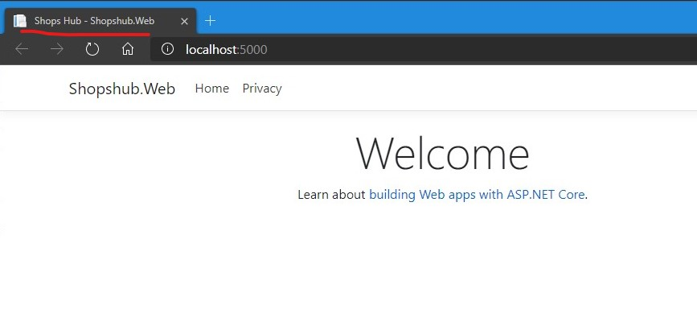

## 创建解决方案

1. 创建一个目录，我这里使用目录名称`Shopshub`。

2. 用命令行创建一个空的解决方案文件，`dotnet new sln`。

    

3. 按照我的习惯，创建一个src目录，用于存放项目文件。
4. 用visual studio 2019打开`Shopshub.sln`文件，在解决方案中也添加src目录，与文件目录对应。
5. 添加一个Web项目

    

6. 项目命名为`Shopshub.Web`。

    

7. 选择MVC项目，其他的还有Razor、Angular等可选。

    

6. 启动项目，打开页面正常加载。这里我没有用IIS Express，所以可以看到打开了一个命令行窗口。

    

到此，一个基础的web项目就创建好了。

## web项目的结构

1. 这时候，在vs内看web项目的结构是这样的：

    

    其中的Controllers、Views、Program.cs、Startup.cs等目录/文件的作用可以另外说明，这里我们先快速的体验一下修改首页。

2. 修改首页的title

默认生成的`HomeController.cs`的首页Action `Index()`是这样的：

```csharp
public IActionResult Index()
{
    return View();
}
```
对应的View在Views/Home/Index.cshtml中：

```csharp
@{
    ViewData["Title"] = "Home Page";
}

<div class="text-center">
    <h1 class="display-4">Welcome</h1>
    <p>Learn about <a href="https://docs.microsoft.com/aspnet/core">building Web apps with ASP.NET Core</a>.</p>
</div>
```

这里我们不在View里直接修改title，而是把它放到Action中修改：

```csharp
public IActionResult Index()
{
    ViewData["Title"] = "Shops Hub";
    return View();
}
```
对应的View在`Views/Home/Index.cshtml`中：

```csharp
<div class="text-center">
    <h1 class="display-4">Welcome</h1>
    <p>Learn about <a href="https://docs.microsoft.com/aspnet/core">building Web apps with ASP.NET Core</a>.</p>
</div>
```

重新运行，查看首页Title，修改成功。



至于这个怎么值怎么传过去的，可以打开布局页面`Views/Home/_Layout.cshtml`：


关于Razor语法，可以查看[微软文档](https://docs.microsoft.com/)