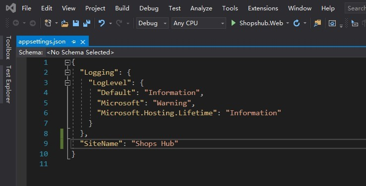
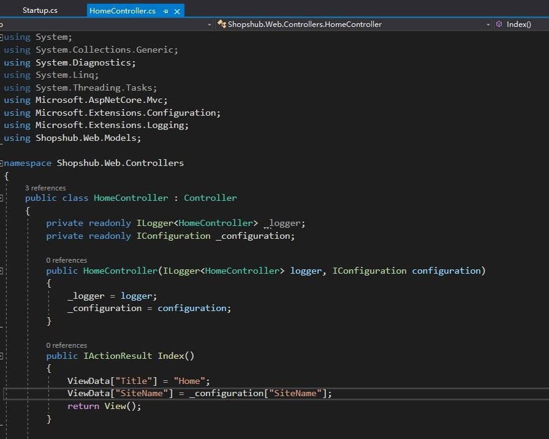
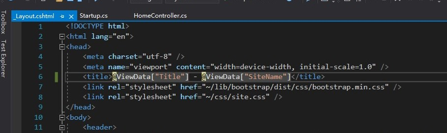
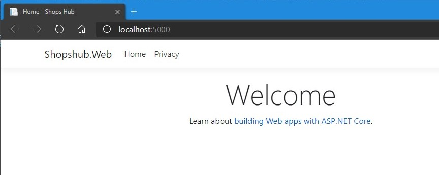
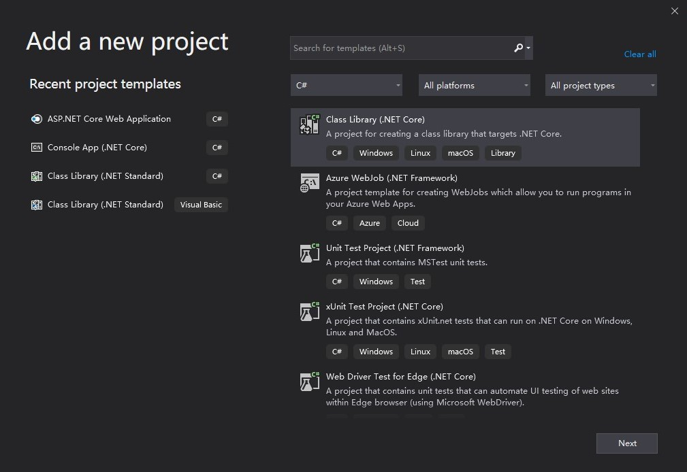
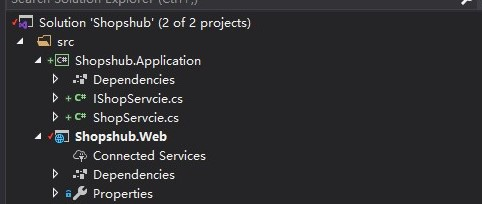
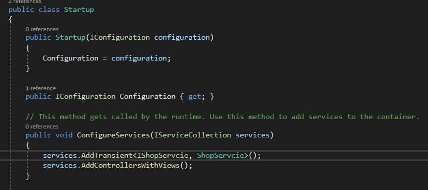
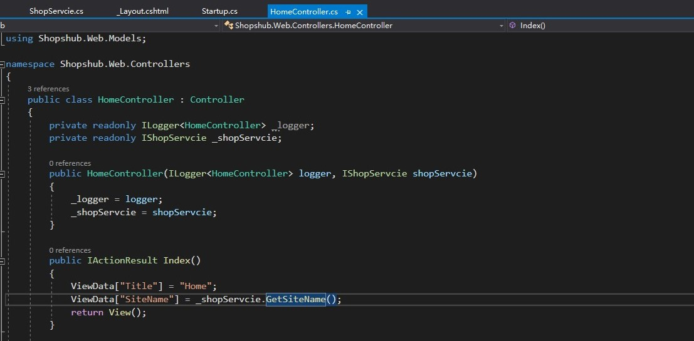

## 使用依赖注入并读取配置文件

演示一下如何简单的读取配置内容。

1. 在`appsetting.json`中增加自定义的配置项`SiteName`

    

2. 在`HomeController`的构造函数中注入`IConfiguration`服务，并在`Index`里读取配置值，传递给ViewData

    

3. 修改`_layout.cshtml`,显示ViewData值

    

4. 到这里，运行程序，打开页面就能看到配置`SiteName`的值`ShopsHub`已经显示到页面的Title上了。

    

关于如何获取配置中的值，参考[微软文档](https://docs.microsoft.com/zh-cn/aspnet/core/fundamentals/configuration/)

## 自定义服务如何使用依赖注入

上面我使用了内置的`IConfiguration`服务，下面演示一下怎样使用一个自己的服务。
习惯上，我要把业务代码放在单独的工程内，这样更清晰并易于维护。

1. 在解决方案中添加一个库项目`Shopshub.Application`

    

2. 添加项目后，在`Shopshub.Web`中添加对`Shopshub.Application`的引用

    

3. 在项目中添加接口和服务，并且把上一节中在HomeController注入的IConfiguration迁移过来

IShopServcie

```csharp
public interface IShopServcie
{
   string GetSiteName();
}
```

ShopServcie

```csharp
public class ShopServcie : IShopServcie
{
    private readonly IConfiguration _configuration;
    public ShopServcie(IConfiguration configuration)
    {
        _configuration = configuration;
    }
    public string GetSiteName()
    {
        return _configuration["SiteName"];
    }
}
```

4. 注入服务

在`Startup.cs`的`ConfigureServices`部分可以进行注入



5. 把`HomeController`中的`IConfiguration`替换为自定义的服务



6. 到此，自定义的服务就可以使用了，以后就可以愉快的写业务代码了。