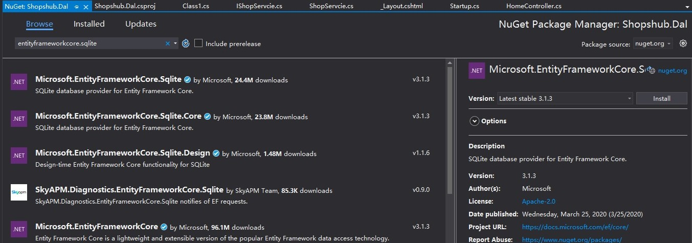

## 使用EFCore进行数据库读取

1. 添加`Shopshub.Dal`项目，并在Application中引用
2. 添加`Microsoft.EntityFrameworkCore.Sqlite`包
    
    

3. 添加`Shop`类
4. 添加Context:`ShopshubContext`
5. 添加数据库连接字符串

```json
  "ConnectionStrings": {
    "Default": "Data Source=shopshub.db"
  }
```

6. 注入Context

```csharp
services.AddDbContext<ShopshubContext>(options =>
{
    options.UseSqlite(Configuration.GetConnectionString("Default"));
});
```

7. 创建`Shopshub.Migrator`项目，用于数据库初始化、创建等工作

使用`Add-Migration`命令生成代码，然后使用`Update-Database`创建数据库
